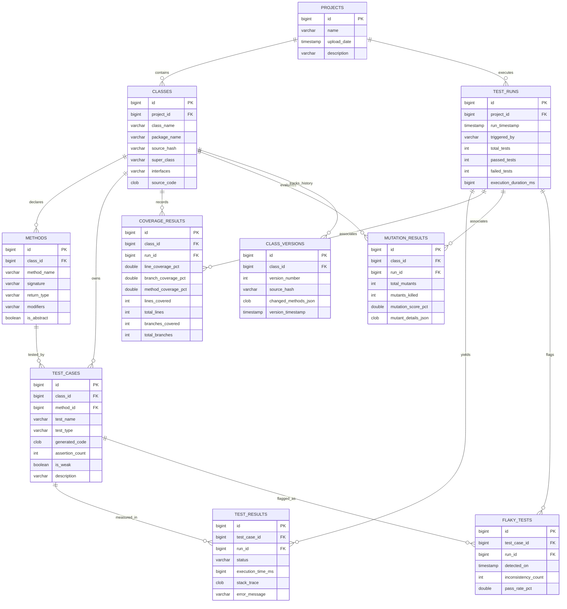

# Entity-Relationship (ER) Diagram & Database Design
## Intelligent Java Test Case Generator (CBP Project)

### 1. Conceptual Design & Normalization Analysis (3NF)

The database schema is strictly normalized to **Third Normal Form (3NF)**:
1. **First Normal Form (1NF)**: All attributes contain atomic scalar values (no multivalued repeating groups or nested arrays). Primary keys uniquely identify every row.
2. **Second Normal Form (2NF)**: All non-key attributes are fully functionally dependent on the entire primary key (no partial functional dependencies).
3. **Third Normal Form (3NF)**: No transitive dependencies exist between non-key attributes ($X \to Y \to Z$). Separate entities exist for Projects, Classes, Methods, Test Cases, Runs, Results, Coverage, Mutation, Flaky Tests, and Class Versions.

---

### 2. Mermaid Entity-Relationship Diagram



---

### 3. Entity Dictionary & Cardinalities

| Entity | Primary Key | Foreign Keys | Relationship Cardinality | Purpose |
|---|---|---|---|---|
| `PROJECTS` | `id` | None | `1 : N` with `CLASSES`, `1 : N` with `TEST_RUNS` | Top-level project container |
| `CLASSES` | `id` | `project_id` $\to$ `PROJECTS(id)` | `1 : N` with `METHODS`, `TEST_CASES`, `COVERAGE_RESULTS`, `MUTATION_RESULTS` | Parsed Java source classes |
| `METHODS` | `id` | `class_id` $\to$ `CLASSES(id)` | `1 : N` with `TEST_CASES` | Methods and constructors |
| `TEST_CASES` | `id` | `class_id` $\to$ `CLASSES(id)`, `method_id` $\to$ `METHODS(id)` | `1 : N` with `TEST_RESULTS`, `FLAKY_TESTS` | Generated test definitions |
| `TEST_RUNS` | `id` | `project_id` $\to$ `PROJECTS(id)` | `1 : N` with `TEST_RESULTS`, `COVERAGE_RESULTS`, `MUTATION_RESULTS` | Execution batch session |
| `TEST_RESULTS` | `id` | `test_case_id`, `run_id` | `N : 1` with `TEST_CASES`, `N : 1` with `TEST_RUNS` | Execution status per test |
| `COVERAGE_RESULTS`| `id` | `class_id`, `run_id` | `N : 1` with `CLASSES`, `N : 1` with `TEST_RUNS` | JaCoCo line/branch/method coverage |
| `MUTATION_RESULTS`| `id` | `class_id`, `run_id` | `N : 1` with `CLASSES`, `N : 1` with `TEST_RUNS` | AST Mutation analysis results |
| `FLAKY_TESTS` | `id` | `test_case_id`, `run_id` | `N : 1` with `TEST_CASES` | Unstable/flaky test tracking |
| `CLASS_VERSIONS` | `id` | `class_id` | `N : 1` with `CLASSES` | AST diffs across uploads |

---

### 4. Advanced DBMS Concepts: SQL View `latest_class_health`

```sql
CREATE OR REPLACE VIEW latest_class_health AS
SELECT 
    c.id AS class_id,
    c.class_name,
    c.package_name,
    c.project_id,
    COALESCE(cov.line_coverage_pct, 0.0) AS latest_line_coverage_pct,
    COALESCE(cov.branch_coverage_pct, 0.0) AS latest_branch_coverage_pct,
    COALESCE(mut.mutation_score_pct, 0.0) AS latest_mutation_score_pct,
    COALESCE(mut.total_mutants, 0) AS total_mutants,
    COALESCE(mut.mutants_killed, 0) AS mutants_killed,
    (SELECT COUNT(*) FROM flaky_tests ft 
     JOIN test_cases tc ON ft.test_case_id = tc.id 
     WHERE tc.class_id = c.id) AS total_flaky_count,
    (SELECT COUNT(*) FROM test_cases tc WHERE tc.class_id = c.id AND tc.is_weak = TRUE) AS weak_test_count
FROM classes c
LEFT JOIN (
    SELECT cr1.* FROM coverage_results cr1
    INNER JOIN (
        SELECT class_id, MAX(id) AS max_id FROM coverage_results GROUP BY class_id
    ) cr2 ON cr1.id = cr2.max_id
) cov ON c.id = cov.class_id
LEFT JOIN (
    SELECT mr1.* FROM mutation_results mr1
    INNER JOIN (
        SELECT class_id, MAX(id) AS max_id FROM mutation_results GROUP BY class_id
    ) mr2 ON mr1.id = mr2.max_id
) mut ON c.id = mut.class_id;
```
